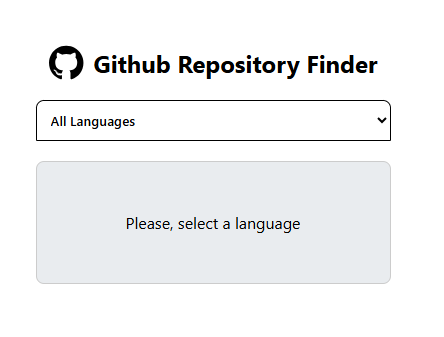
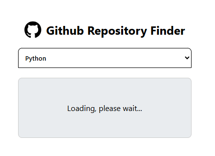
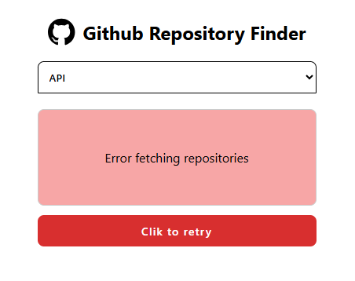
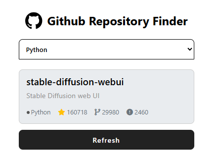

# 🔍 GitHub Random Repository

A simple and interactive web application that helps users discover random GitHub repositories based on their preferred programming language. This project was built as a challenge from roadmap.sh.

---
## 🔗 Quick Links

* **[Live Demo Site](https://assem44.github.io/github-random-repository)**
* **[Roadmap.sh Project](https://roadmap.sh/projects/github-random-repo)**

## Features

- **Language Selection:** Choose from various programming languages (JavaScript, Python, Java, etc.).
- **Random Discovery:** Fetches a random repository using the GitHub Search API.
- **Repository Details:** Displays the name, description, stars, forks, and open issues.
- **UI States Management:** - **Empty State:** Initial screen before selecting a language.
  - **Loading State:** Smooth feedback while fetching data.
  - **Error State:** Clear error messages with a "Retry" button if something goes wrong.
- **Refresh Capability:** Easily fetch another random repository with one click.

## Built With

- **HTML5** & **CSS3** (Responsive UI)
- **JavaScript (ES6+)**
- **GitHub Search API** (Asynchronous data fetching with `fetch` and `async/await`)

## Preview

<table border="0">
  <tr>
    <td align="center" width="50%">
      <strong>Empty State</strong>
      
       
    </td>
    <td align="center" width="50%">
      <strong>Loading State</strong>
      
       
    </td>
  </tr>
  <tr>
    <td align="center" width="50%">
      <strong >Error State</strong>
      
       
    </td>
    <td align="center" width="50%">
      <strong>Success State</strong>
      
       
    </td>
  </tr>
</table>
